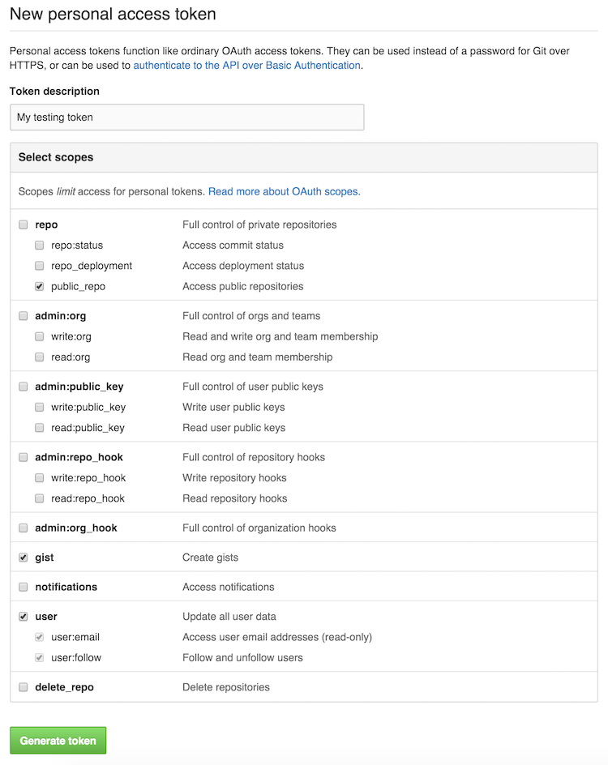

## Getting Started with the GitHub API

This are my notes from
* [Getting Started with the GitHub API](https://developer.github.com/guides/getting-started/)


All API access is over HTTPS, and accessed from the [https://api.github.com](https://api.github.com). All data is sent and received as JSON.

```bash
$ curl https://api.github.com/zen
Practicality beats purity.
```
Next, let's GET Chris Wanstrath's GitHub profile:

```bash
[~/local/src/javascript/learning/useoctonode(master)]$ curl httdefunkti.github.com/users/
{
  "login": "defunkt",
  "id": 2,
  "avatar_url": "https://avatars.githubusercontent.com/u/2?v=3",
  "gravatar_id": "",
  "url": "https://api.github.com/users/defunkt",
  "html_url": "https://github.com/defunkt",
  "followers_url": "https://api.github.com/users/defunkt/followers",
  "following_url": "https://api.github.com/users/defunkt/following{/other_user}",
  "gists_url": "https://api.github.com/users/defunkt/gists{/gist_id}",
  "starred_url": "https://api.github.com/users/defunkt/starred{/owner}{/repo}",
  "subscriptions_url": "https://api.github.com/users/defunkt/subscriptions",
  "organizations_url": "https://api.github.com/users/defunkt/orgs",
  "repos_url": "https://api.github.com/users/defunkt/repos",
  "events_url": "https://api.github.com/users/defunkt/events{/privacy}",
  "received_events_url": "https://api.github.com/users/defunkt/received_events",
  "type": "User",
  "site_admin": true,
  "name": "Chris Wanstrath",
  "company": "@github ",
  "blog": "http://chriswanstrath.com/",
  "location": "San Francisco",
  "email": "chris@github.com",
  "hireable": true,
  "bio": "🍔 ",
  "public_repos": 107,
  "public_gists": 273,
  "followers": 15785,
  "following": 208,
  "created_at": "2007-10-20T05:24:19Z",
  "updated_at": "2016-09-13T19:41:49Z"
}
```
Let's add the `-i` flag to include headers:
```bash
[~/local/src/javascript/learning/useoctonode(master)]$ curl -i https://api.github.com/users/defunkt
HTTP/1.1 200 OK
Server: GitHub.com
Date: Wed, 19 Oct 2016 08:45:02 GMT
Content-Type: application/json; charset=utf-8
Content-Length: 1279
Status: 200 OK
X-RateLimit-Limit: 60
X-RateLimit-Remaining: 52
X-RateLimit-Reset: 1476869390
Cache-Control: public, max-age=60, s-maxage=60
Vary: Accept
ETag: "13d508c755ed50356ffe80addaabc786"
Last-Modified: Tue, 13 Sep 2016 19:41:49 GMT
X-GitHub-Media-Type: github.v3
Access-Control-Expose-Headers: ETag, Link, X-GitHub-OTP, X-RateLimit-Limit, X-RateLimit-Remaining, X-RateLimit-Reset, X-OAuth-Scopes, X-Accepted-OAuth-Scopes, X-Poll-Interval
Access-Control-Allow-Origin: *
Content-Security-Policy: default-src 'none'
Strict-Transport-Security: max-age=31536000; includeSubdomains; preload
X-Content-Type-Options: nosniff
X-Frame-Options: deny
X-XSS-Protection: 1; mode=block
Vary: Accept-Encoding
X-Served-By: d021ed23fc00327f4c0f77bc363ef16f
X-GitHub-Request-Id: C1917C49:10F88:DF7813F:5807328D

{
  "login": "defunkt",
  "id": 2,
  "avatar_url": "https://avatars.githubusercontent.com/u/2?v=3",
  "gravatar_id": "",
  "url": "https://api.github.com/users/defunkt",
  "html_url": "https://github.com/defunkt",
  "followers_url": "https://api.github.com/users/defunkt/followers",
  "following_url": "https://api.github.com/users/defunkt/following{/other_user}",
  "gists_url": "https://api.github.com/users/defunkt/gists{/gist_id}",
  "starred_url": "https://api.github.com/users/defunkt/starred{/owner}{/repo}",
  "subscriptions_url": "https://api.github.com/users/defunkt/subscriptions",
  "organizations_url": "https://api.github.com/users/defunkt/orgs",
  "repos_url": "https://api.github.com/users/defunkt/repos",
  "events_url": "https://api.github.com/users/defunkt/events{/privacy}",
  "received_events_url": "https://api.github.com/users/defunkt/received_events",
  "type": "User",
  "site_admin": true,
  "name": "Chris Wanstrath",
  "company": "@github ",
  "blog": "http://chriswanstrath.com/",
  "location": "San Francisco",
  "email": "chris@github.com",
  "hireable": true,
  "bio": "🍔 ",
  "public_repos": 107,
  "public_gists": 273,
  "followers": 15785,
  "following": 208,
  "created_at": "2007-10-20T05:24:19Z",
  "updated_at": "2016-09-13T19:41:49Z"
}
```
There are a few interesting bits in the response headers. As expected, the `Content-Type` is `application/json`.

Any headers beginning with `X-` are custom headers, and are not included in the HTTP spec. Let's take a look at a few of them:

* `X-GitHub-Media-Type` has a value of `github.v3`. This lets us know the media type for the response. Media types have helped us version our output in API v3. We'll talk more about that later.
* Take note of the `X-RateLimit-Limit` and `X-RateLimit-Remaining` headers. This pair of headers indicate how many requests a client can make in a rolling time period (typically an hour) and how many of those requests the client has already spent.

### Authentication
Unauthenticated clients can make 60 requests per hour. To get more, we'll need to authenticate. In fact, doing anything interesting with the GitHub API requires authentication.

#### Basic
The easiest way to authenticate with the GitHub API is by simply using your GitHub username and password via Basic Authentication.

```bash
curl -i -u your_username https://api.github.com/users/defunkt

Enter host password for user your_username:
```

The -u flag sets the username, and cURL will prompt you for the password. You can use -u "username:password" to avoid the prompt, but this leaves your password in shell history and isn't recommended. When authenticating, you should see your rate limit bumped to 5,000 requests an hour, as indicated in the `X-RateLimit-Limit` header.

In addition to just getting more calls per hour, authentication is the key to reading and writing private information via the API.

### OAuth

While convenient, Basic Authentication isn't ideal because you shouldn't give your GitHub username and password to anyone. Applications that need to read or write private information using the API on behalf of another user should use OAuth.

Instead of usernames and passwords, OAuth uses tokens. Tokens provide two big features:

* **Revokable access:** users can revoke authorization to third party apps at any time
* **Limited access:** users can review the specific access that a token will provide before authorizing a third party app

Normally, tokens are created via a [web flow](https://developer.github.com/v3/oauth/#web-application-flow). An application sends users to GitHub to log in. GitHub then presents a dialog indicating the name of the app, as well as the level of access the app has once it's authorized by the user. After a user authorizes access, GitHub redirects the user back to the application:


However, you don't need to set up the entire web flow to begin working with OAuth tokens. An easier way to get a token is to create a [personal access token](https://help.github.com/articles/creating-an-access-token-for-command-line-use/) via your [Personal access tokens settings page](https://github.com/settings/tokens):



```bash
$ curl -i https://api.github.com/users/octocat/orgs
HTTP/1.1 200 OK
Server: GitHub.com
Date: Wed, 19 Oct 2016 08:32:11 GMT
Content-Type: application/json; charset=utf-8
Content-Length: 5
Status: 200 OK
X-RateLimit-Limit: 60
X-RateLimit-Remaining: 58
X-RateLimit-Reset: 1476869390
Cache-Control: public, max-age=60, s-maxage=60
Vary: Accept
ETag: "98f0c1b396a4e5d54f4d5fe561d54b44"
X-GitHub-Media-Type: github.v3
Access-Control-Expose-Headers: ETag, Link, X-GitHub-OTP, X-RateLimit-Limit, X-RateLimit-Remaining, X-RateLimit-Reset, X-OAuth-Scopes, X-Accepted-OAuth-Scopes, X-Poll-Interval
Access-Control-Allow-Origin: *
Content-Security-Policy: default-src 'none'
Strict-Transport-Security: max-age=31536000; includeSubdomains; preload
X-Content-Type-Options: nosniff
X-Frame-Options: deny
X-XSS-Protection: 1; mode=block
Vary: Accept-Encoding
X-Served-By: 075bb2f6b7031ca3c0e69edb17939fae
X-GitHub-Request-Id: C1917C49:10F84:71A9618:58072F8A

[

]
```
